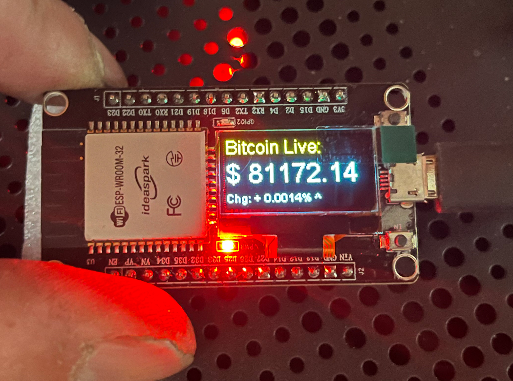

# 🚀 ESP32 Bitcoin Live Ticker - SD Edition

Dieses Projekt zeigt Bitcoin-Echtzeitdaten auf einem OLED-Display an. Die Konfiguration erfolgt bequem über eine SD-Karte, sodass SSID und Passwort nicht im Code stehen müssen.

## 📂 Repository Struktur

Das Repository ist in zwei Hardware-Versionen unterteilt:

### 1. [ESP32-Wroom + SD-Adapter](./ESP32-Wroom-SD)
Für Standard ESP32-Boards mit externem SD-Kartenmodul.
*   **Display:** Integriert oder I2C (SDA: 21, SCL: 22)
*   **SD-Anbindung:** SPI-Modus (MISO: 19, MOSI: 23, SCK: 18, CS: 5)

### 2. [ESP32-CAM-Version](./ESP32-CAM-SD)
Optimiert für das ESP32-CAM Board mit integriertem SD-Slot.
*   **Besonderheit:** Nutzt den SD_MMC Bus im 1-Bit Modus, um Pins für das Display frei zu halten.
*   **Display-Pins:** SDA: GPIO 13, SCL: GPIO 12
*   **Spannung:** Empfohlen wird der Anschluss des Displays an 5V, um Helligkeitsprobleme bei SD-Zugriffen zu vermeiden.

---



## ⚙️ Konfiguration (SD-Karte)
Erstelle eine Datei namens `wifi.txt` im Hauptverzeichnis deiner MicroSD-Karte (FAT32 formatiert):

```text
DEINE_WLAN_SSID
DEIN_WLAN_PASSWORT
```

## ✨ Features
- 💰 **Preise:** Live-Kurse in EUR und USD von CryptoCompare.
- 📉 **Trend:** Prozentuale Änderung und Tendenz-Pfeile (^ / v).
- ⛓️ **Blockchain:** Große Anzeige der aktuellen Blockhöhe.
- 🚦 **Mempool:** Aktuelle Gebühren (Fast/Med/Slow) von mempool.space.
- 🕒 **NTP:** Automatische Uhrzeitsynchronisation.
- 💡 **Low-Fee-Alert:** Onboard LED leuchtet bei Gebühren <= 5 sat/vB.

## 📚 Benötigte Bibliotheken
- `ESP8266 and ESP32 OLED driver for SSD1306`
- `ArduinoJson`
- `SD_MMC` & `HTTPClient` (Standard ESP32 Core)

## 🔧 Board-Einstellungen (Arduino IDE)

Stelle sicher, dass du im Boardverwalter das passende Board auswählst:

### Für die Wroom-Version:
*   **Board:** `DOIT ESP32 DEVKIT V1` (oder allgemein `ESP32 Dev Module`)
*   **Upload Speed:** `115200`
*   **Flash Frequency:** `80MHz`


### Für die ESP32-CAM-Version:
*   **Board:** `AI Thinker ESP32-CAM`
*   **CPU Frequency:** `240MHz (WiFi/BT)`
*   **Flash Mode:** `QIO`
*   **Partition Scheme:** `Huge App (3MB No OTA/1MB SPIFFS)` (Wichtig, da der Code durch die Bibliotheken groß ist)
*   **Anschluss:** Zum Flashen muss **GPIO 0 mit GND** verbunden werden!


Falls beimHochladen in den ESP32 der Speicherplatz nicht reicht, unter Werkzeuge das Partition Scheme auf Huge App umstellen.

---
Erstellt mit ❤️ für die Bitcoin-Community.
