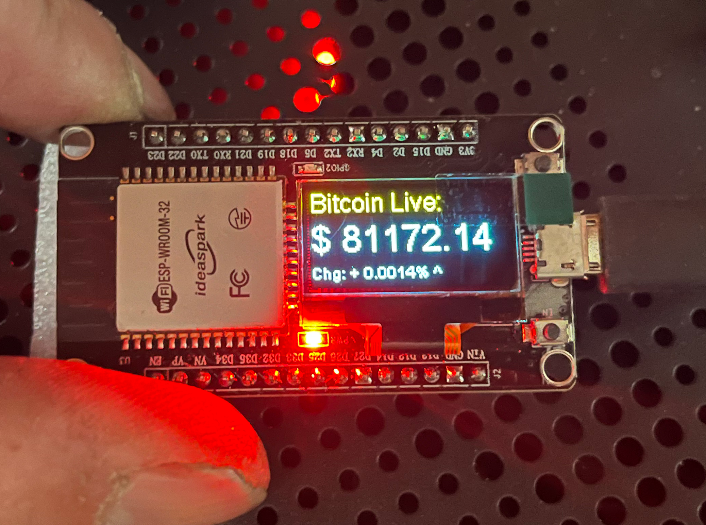
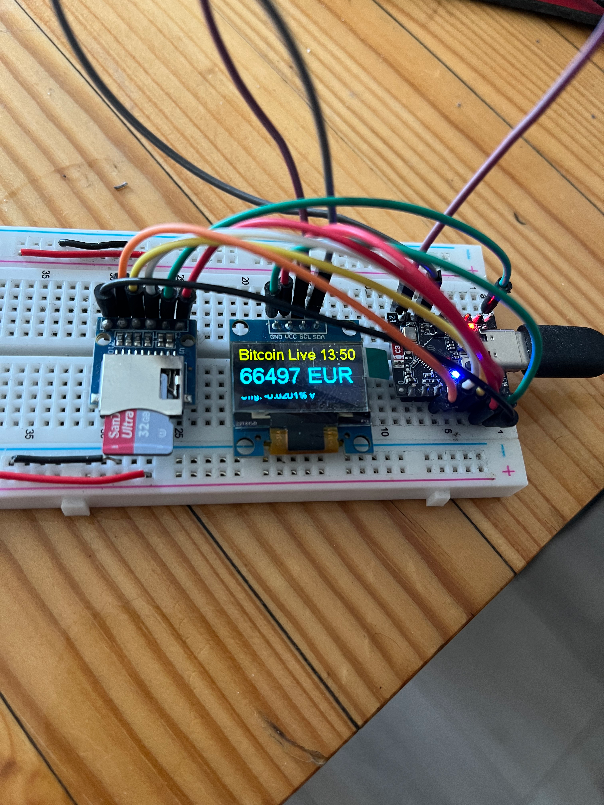
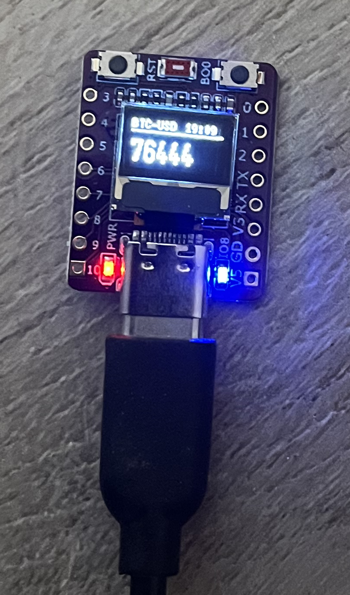
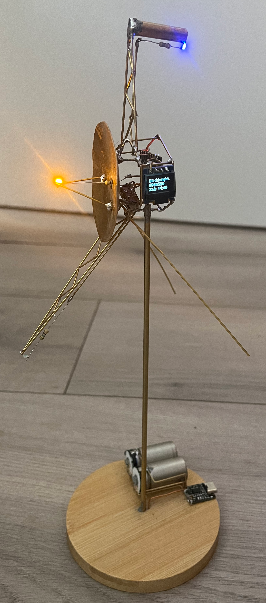

# 🚀 ESP32 Bitcoin Live Ticker - Multifunktions-Edition

Dieses Open-Source-Projekt zeigt Bitcoin-Echtzeitdaten auf verschiedenen OLED- und IPS-Displays an. Die Ticker bieten Live-Kurse, prozentuale Tendenzen, die aktuelle Blockzeit sowie detaillierte Mempool-Gebührenwächter.

## 📂 Repository Struktur

Das Repository ist in sechs spezialisierte Hardware-Versionen unterteilt:

### 1. [ESP32-Wroom Ticker (WiFi-Manager Edition)](./ESP32-WROOM-Oled-Bitcoin-Ticker-SD-Card)
Für Standard ESP32-Boards mit I2C-OLED (SDA: 21, SCL: 22).
*   **Besonderheit:** Komplett auf **WiFiManager** umgestellt! Keine festen WLAN-Daten im Code. Bietet einen Hardware-Reset via BOOT-Button (GPIO 0). Zeichnet einen fortlaufenden Autoscale-Live-Chart der letzten 32 Minuten (64 Punkte).




### 2. [ESP32-CAM (Diebstahlsichere Edition)](./ESP32-CAM-Bitcoin-Ticker-SD-Card)
Optimiert für das ESP32-CAM Board mit integriertem MicroSD-Slot (SDA: GPIO 13, SCL: GPIO 12).
*   **Besonderheit:** **Integrierter Diebstahlschutz!** Importiert beim Booten die `wifi.txt` von der SD-Karte flüchtig in den internen CPU-Flash (Preferences) und **löscht die Datei sofort unwiderruflich von der Karte**. Zeigt nach 32 Minuten den vollautomatisch skalierten Live-Chart.


### 3. [ESP32-C3-Version (Diebstahlsicherer für den zukünftigen Messing-Satellit)](./ESP32-C3-Ext-Oled-Ext-SD-Cardreader-Bitcoin-Ticker)
Optimiert für das stromsparende ESP32-C3-Board mit externem SD-Kartenleser (SDA: GPIO 10, SCL: GPIO 21).
*   **Besonderheit:** Nutzt dasselbe **Diebstahlschutz-Löschverfahren** via NVS-Speicher über die sichtbare `wifi.txt`. Bietet Hardware-SPI-Bus-Trennung zur Vermeidung von Signalstörungen.




### 4. [ESP32-C3 Mini-Version (WiFi-Manager Edition)](./ESP32-C3-OLED-72x40)
Ultraminimale Standalone-Version ohne SD-Kartenleser für den Schreibtisch (SDA: GPIO 5, SCL: GPIO 6).
*   **Besonderheit:** Komplett auf **WiFiManager** umgestellt! Bietet einen physischen Werksreset über den BOOT-Button (GPIO 9) und zeigt bei fehlender Verbindung eine bequeme Handy-Anleitung auf dem 72x40 Mini-Display. Inklusive 18-Minuten-Trend-Chart.




### 5. [ESP32-C3 Bitcoin Brass Satellite Ticker](./ESP32-C3-Satellite)
Ein ultrakompakter, autonomer Bitcoin- und Mempool-Ticker, verpackt in einem kunstvoll handgelöteten Messing-Drahtskelett. Das Projekt basiert auf dem **ESP32-C3 SuperMini** und visualisiert Live-Blockchain-Daten auf einem winzigen 0,49" OLED-Display, begleitet von drei unabhängig voneinander blinkenden Status-LEDs.
*   **Besonderheit:** Sendeleistung softwareseitig aggressiv gedrosselt (`8.5dBm`), um elektromagnetische Interferenzen mit den dichten Messing-Drahtbahnen zu verhindern.




### 6. [ESP32-S3 Bitcoin Ticker & Rechner-Terminal](./ESP32-2.8inch-TouchScreen-Bitcoin-Ticker)
Premium-Desktop-Ausführung optimiert für das **2,8" IPS-Touch-Display (ES3C28P)** mit kapazitivem Controller im edlen Terminal-Look.
*   **Besonderheit:** Läuft auf der hochperformanten **LVGL 9 Grafik-Engine** gekoppelt mit LovyanGFX. Beinhaltet ein lokales Web-Interface zur Konfiguration des automatischen Seitenwechsels (Auto-Rotate) und der Chart-Intervalle.
*   **Interaktiver Satoshi-Rechner:** Über ein Wischen auf Seite 5 öffnet sich ein voll nativer, klicksicherer Dreisatz-Rechner mit Touch-Tastatur, Zeilen-Selektoren (Sats/EUR/USD) und Live-Daten-Einspeisung. Schützt den Workflow durch automatische Rotations-Sperre auf der Rechner-Seite.


## ✨ Features

- **Schlüssellose API-Abfragen:** Voller Abruf aller Live-Preise (EUR/USD), Mempool-Gebühren (Mempool-Gebührenwächter) und Blockchain-Metriken direkt von der dezentralen Open-Source-Plattform `mempool.space`.
- **Echte LVGL 9 Trend-Charts:** Autarke Grafik-Pufferung mit integriertem **Autoscale-Algorithmus (5% Padding)** und dunkelgrauem Linienraster. Komplett flackerfrei gedrosselt, um jegliches Display-Flimmern softwareseitig auszuschließen.
- **WiFiManager AP-Portal:** Komfortable, kabellose Ersteinrichtung des WLANs über ein mobiles Web-Portal mitsamt exakter Handy-Anleitung direkt auf dem Display bei fehlender Verbindung.
- **Uhrzeit & NTP:** Vollautomatische Synchronisation der systemweiten Uhrzeit im Hintergrund mitsamt ruckelfreiem, getaktetem Doppelpunkt-Blinker im Terminal-Look.
- **Low-Fee-Alarm:** Optische / softwareseitige Benachrichtigung, sobald die Netzwerk-Transaktionsgebühren unter ein kritisches Niveau fallen.

## 📌 Hardware-Pinout (Premium 2.8" Terminal ES3C28P)

| Komponente / Bus | Pin (GPIO) | Beschreibung / Hardware-Logik |
| :--- | :---: | :--- |
| **Display SPI SCLK** | `12` | SPI-Taktleitung zum ILI9341 IPS-Panel |
| **Display SPI MOSI** | `11` | SPI-Datenleitung (Master Out Slave In) |
| **Display SPI MISO** | `13` | SPI-Rückleitung (Master In Slave Out) |
| **Display SPI CS** | `10` | Chip Select für das Grafik-Panel |
| **Display DC / RS** | `46` | Data / Command Umschaltleitung |
| **Display Backlight (BL)** | `45` | PWM-gesteuerte LED-Hintergrundbeleuchtung (44,1 kHz Takt) |
| **Touch I2C SDA** | `16` | I2C Datenleitung zum kapazitiven FT5x06 Controller |
| **Touch I2C SCL** | `15` | I2C Taktleitung zum kapazitiven FT5x06 Controller |
| **Hardware BOOT-Button**| `0` | 3 Sekunden gedrückt halten beim Booten löscht den WLAN-Speicher |

## ⚙ Netzwerk-Konfiguration & Web-Reset

### 1. Für die WiFiManager-Editionen (Wroom, C3-Mini & S3-Terminal):
Sollte der Ticker kein Netzwerk finden, öffnet er ein geschütztes Konfigurations-WLAN (z. B. `ES3C28P-BTC-Ticker-AP`).
1. Verbinde dein Smartphone mit dem angezeigten AP-Netzwerk.
2. Rufe im Browser die IP-Adresse `192.168.4.1` auf.
3. Wähle dein Heim-WLAN aus und tippe das Passwort ein.
*   **Hardware-Werksreset:** Halte beim Einschalten des Geräts den physischen **BOOT-Button** (S3/Wroom: GPIO 0 / C3: GPIO 9) für 3 Sekunden gedrückt.
*   **Webserver-Reset:** Über das Dashboard des S3-Terminals im Browser kann über den roten Button `"WLAN loeschen & neu starten"` der unbarmherzige Befehl `WiFi.disconnect(true, true)` gefeuert werden, welcher das Passwort-Gedächtnis im NVS-Flash dauerhaft formatiert.

### 2. Für die Diebstahlsicheren SD-Editionen (CAM & SD-C3):
Erstelle eine Textdatei namens `wifi.txt` im Hauptverzeichnis deiner MicroSD-Karte (FAT32 formatiert):
```text
DEINE_WLAN_SSID
DEIN_WLAN_PASSWORT
```
*   **Der Sicherheits-Ablauf:** Beim ersten Start liest der Ticker die Karte aus, brennt die Daten fest in den internen, geschützten Speicher (NVS) des ESP32-Chips und **löscht die `wifi.txt` sofort vollständig von der SD-Karte**. 

## 🛠 Abhängigkeiten (Arduino IDE Libraries)

Folgende Bibliotheken müssen im Bibliotheksverwalter der Arduino IDE in den aktuellen Versionen installiert sein:
- `lvgl` (Offizieller Core-Support für Version 9.x zwingend erforderlich)
- `LovyanGFX` (Leistungsstarker Display-Treiber-Zubringer für ESP32-S3)
- `WiFiManager` by tzapu / tablatronix (Für die schlüssellosen Web-Setup-Versionen)
- `ArduinoJson` (Benoit Blanchon, Version 7.x empfohlen)
- `ESPAsyncWebServer` & `AsyncTCP` (Für das interaktive Web-Dashboard)

---
Erstellt mit ❤ für die Bitcoin- und Bastler-Community. Frei von kommerziellen Markenrechten.
